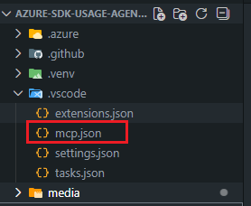
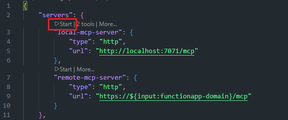
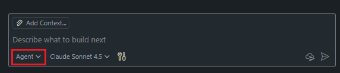
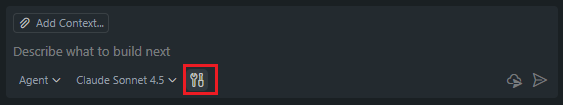
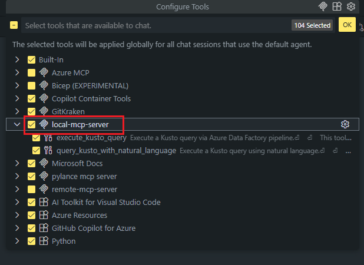

# Host MCP Servers on Azure Functions for Kusto Data Queries via Azure Data Factory

This repo contains instructions and sample for running MCP server built with the Python MCP SDK on Azure Functions. The server provides powerful Kusto query capabilities through Azure Data Factory integration:

- **Direct Kusto Query Execution**: Execute raw KQL (Kusto Query Language) queries directly
- **Natural Language to Kusto**: Convert natural language questions into Kusto queries and execute them automatically
- **Formatted Results**: Returns well-formatted query results with execution details
- **Robust Error Handling**: Comprehensive error handling and informative error messages

## Prerequisites

Ensure you have the following:

* [Azure CLI](https://learn.microsoft.com/cli/azure/install-azure-cli) v2.65.0 or above
* [Azure Developer CLI](https://learn.microsoft.com/azure/developer/azure-developer-cli/install-azd) v1.17.2 or above
* [Azure Functions Core Tools](https://learn.microsoft.com/azure/azure-functions/functions-run-local?tabs=windows%2Cisolated-process%2Cnode-v4%2Cpython-v2%2Chttp-trigger%2Ccontainer-apps&pivots=programming-language-typescript) v4.5.0 or above
* [Visual Studio Code](https://code.visualstudio.com/)
* [Azure Functions extension on Visual Studio Code](https://marketplace.visualstudio.com/items?itemName=ms-azuretools.vscode-azurefunctions)
* [uv](https://docs.astral.sh/uv/getting-started/installation/)

>[!NOTE]
>You can run the installation script in the `scripts` directory to set up prerequisites quickly:
>- **Linux/macOS**: Run `bash scripts/install.sh`
>- **Windows**: Run `powershell -ExecutionPolicy Bypass -File scripts/install.ps1`
>
>The script will check all prerequisites and automatically install or update missing/outdated components. When successful, you'll see:
>```
>[OK] All prerequisites are installed and up to date!
>```
>or
>```
>[OK] All operations completed!
>``` 

## Run locally

1. In the root directory, run `uv run func start` to create the virtual environment, install dependencies, and start the server locally
1. Open terminal and input `az login` select `Azure SDK Engineering System`

    
1. Open _mcp.json_ (in the _.vscode_ directory)

    
1. Start the server by selecting the _Start_ button above the **local-mcp-server**

    
1. Click on the Copilot icon at the top to open chat (or `Ctrl+Command+I / Ctrl+Alt+I`), and then change to _Agent_ mode in the question window.

    
1. Click the tools icon and make sure **local-mcp-server** is checked for Copilot to use in the chat:

    

    
1. Once the server displays the number of tools available, ask "#local-mcp-server Can you rerun this Query ..." Copilot should call the kusto tools to help answer this question.
1. Deactivate the virtual environment `deactivate`

>[!NOTE]
>When the server starts locally, the Azure Functions host first pings the root (`/`) to ensure the app is up and running. Since the root isn't implemented, a 404 is returned. 
>
>Info logs coming from the MCP SDK may be written to stderr by default, which is why they appear red in Azure Functions.
