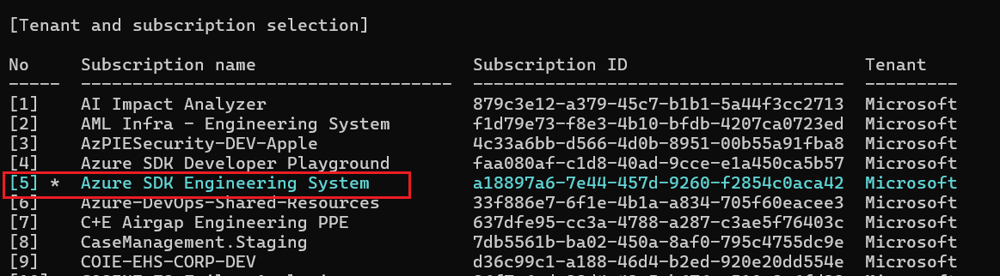
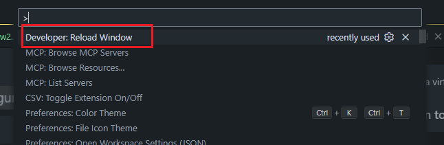
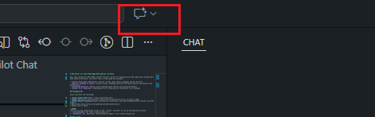
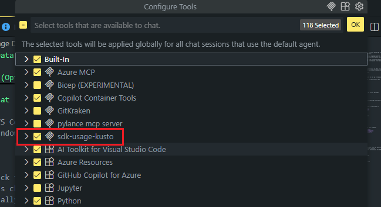
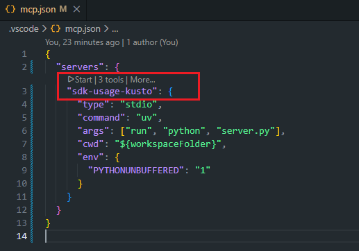
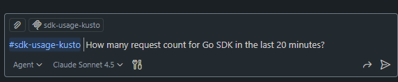

# MCP Server for Azure SDK Usage Data Queries via Kusto

This repo contains an MCP (Model Context Protocol) server for querying Azure SDK usage data through Azure Data Factory and Kusto. The server runs in stdio mode and provides:

- **Direct Kusto Query Execution**: Execute raw KQL (Kusto Query Language) queries directly
- **Natural Language to Kusto**: Convert natural language questions into Kusto queries and execute them automatically
- **Formatted Results**: Returns well-formatted query results with execution details
- **Robust Error Handling**: Comprehensive error handling and informative error messages

## 🆕 Azure Data Factory Implementations

This project includes **two implementations** for Azure Data Factory operations:

### 🔵 REST API (`src/adf/`)
Traditional HTTP REST API-based implementation with manual control over requests.

### 🟢 Azure SDK (`src/adfSDK/`) - **Recommended**
Modern SDK-based implementation with automatic authentication and type safety.

📖 **[View detailed comparison and migration guide](PROJECT_STRUCTURE.md)**

## Prerequisites

Ensure you have the following:

* [Visual Studio Code](https://code.visualstudio.com/)
* [Azure CLI](https://learn.microsoft.com/cli/azure/install-azure-cli) v2.65.0 or above
* [GitHub Copilot extension](https://marketplace.visualstudio.com/items?itemName=GitHub.copilot) with MCP support
* [uv](https://docs.astral.sh/uv/getting-started/installation/)
* Python 3.10 or above

>[!NOTE]
>You can run the installation script in the `scripts` directory to set up prerequisites quickly:
>- **Linux/macOS**: Run `bash scripts/install.sh`
>- **Windows**: Run `powershell -ExecutionPolicy Bypass -File scripts/install.ps1`

## How to Use

Follow these steps to start using the MCP server:

### Step 1: Install Dependencies
```bash 
uv sync
```

This will create a virtual environment and install all required Python packages.

### Step 2: Login to Azure
```bash
az login
```


Select **Azure SDK Engineering System** when prompted. This is required to access the Azure Data Factory pipeline.

### Step 3: Reload VS Code Window (Option)

The MCP server is already configured in `.vscode/mcp.json`. To activate it:

1. Press `Ctrl+Shift+P` (Linux/Windows) or `Cmd+Shift+P` (Mac)
2. Type "Reload Window" and select **Developer: Reload Window**



### Step 4: Open GitHub Copilot Chat

1. Click the Copilot icon in the VS Code activity bar
2. Or press `Ctrl+Alt+I` (Linux/Windows) or `Cmd+Ctrl+I` (Mac)



### Step 5: Enable the MCP Server

1. In the Copilot Chat window, click the **tools icon** (🔧)
2. Make sure **sdk-usage-kusto** is checked



3. The server will start automatically when you first use it
   - If it doesn't start automatically, click the **Start** button next to **sdk-usage-kusto** in the tools list



### Step 6: Start Asking Questions

You can now query Azure SDK usage data using natural language. For example:

- **"How many request count for Go SDK in the last 20 minutes?"**
- **"Show me the the usage of all Compute APIs in last day"**
- **"Generate a KQL query to find all Python Track2 SDK requests"**
- **"Execute this KQL query: [paste your KQL query]"**



The MCP server will automatically:
- Convert your natural language questions into KQL queries
- Execute queries via Azure Data Factory
- Format and return the results
- Optionally export results to CSV files (if requested)

## Available Tools

The MCP server provides three tools:

1. **generate_kql_query_tool**: Convert natural language questions into KQL queries
2. **execute_kusto_query_tool**: Execute KQL queries and retrieve results
3. **get_kusto_helper_functions_tool**: Get KQL helper function definitions for SDK analysis

## Troubleshooting

**Server not appearing in Copilot Chat:**
- Ensure you've reloaded the VS Code window after configuration
- Check that `uv` is installed and accessible from your PATH
- Verify Azure login with `az account show`

**Query execution fails:**
- Confirm you're logged into Azure with the correct subscription
- Check your network connection
- Verify Azure Data Factory permissions

